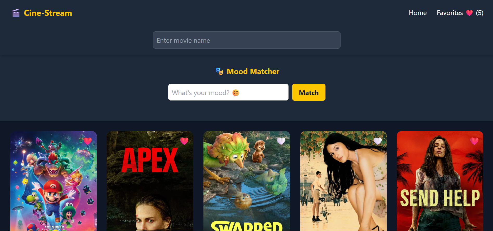
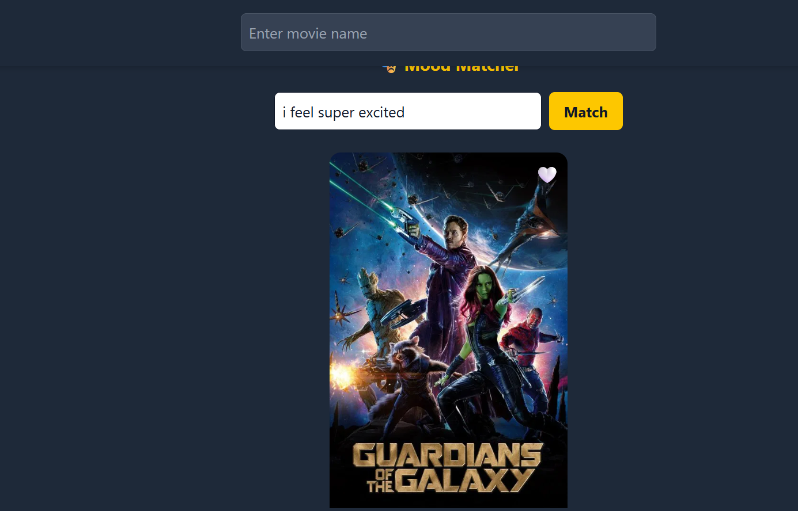
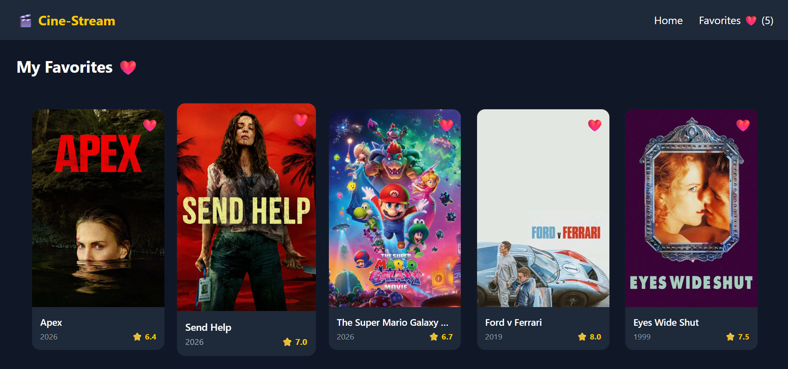

# 🎬 Cine-Stream

> A Netflix-inspired movie discovery app built with React, powered by TMDB API and Google Gemini AI.


---

## 📸 Screenshots

### 🏠 Home Page

```
[ Screenshot: Home page with movie grid ]
```

### 🎭 Mood Matcher

```
[ Screenshot: Mood Matcher with AI result ]
```

### ❤️ Favorites Page

```
[ Screenshot: Favorites page ]
```

---

## ✨ Features

### 🟢 Level 1 — Core Application
- 🎥 **Popular Movies** — Fetches and displays trending movies from TMDB on load
- 🔍 **Live Search** — Search any movie by title using TMDB's search endpoint
- 🃏 **Movie Cards** — Displays poster, title, release year, and rating
- ⚡ **Debouncing** — Prevents excessive API calls while typing (500ms delay)
- 🖼️ **Fallback Poster** — Gracefully handles missing movie posters
- ⏳ **Loading & Error States** — Smooth UX with spinners and error messages

### 🟡 Level 2 — Performance Mastery
- ♾️ **Infinite Scroll** — Automatically loads more movies as you scroll using Intersection Observer API
- ❤️ **Favorites System** — Save movies with a heart icon, persisted in localStorage
- 🗂️ **React Router** — Client-side routing between Home and Favorites pages
- 🧠 **Custom Hook** — `useFavorites` encapsulates all favorites logic cleanly

### 🔴 Level 3 — Advanced Features
- 🤖 **AI Mood Matcher** — Type your mood, get a movie recommendation powered by Google Gemini
- 🦥 **Lazy Loading** — Native `loading="lazy"` on all movie poster images
- 🎯 **Silent TMDB Search** — AI returns a title, app silently fetches it from TMDB

---

## 🏗️ Project Structure

```
cine-stream/
├── public/
├── src/
│   ├── assets/
│   │   └── no_poster.png          # Fallback poster image
│   ├── components/
│   │   ├── Error.jsx              # Error display component
│   │   ├── FavoritesPage.jsx      # Favorites route page
│   │   ├── LoadingSpinner.jsx     # Animated loading spinner
│   │   ├── MoodMatcher.jsx        # AI mood input + result display
│   │   ├── MovieCard.jsx          # Individual movie card
│   │   ├── MovieGrid.jsx          # CSS Grid layout for cards
│   │   ├── Navbar.jsx             # Navigation with favorites count
│   │   └── SearchBar.jsx          # Debounced search input
│   ├── hooks/
│   │   └── useFavorites.js        # Custom hook for favorites + localStorage
│   ├── services/
│   │   └── geminiService.js       # Google Gemini AI integration
│   ├── App.jsx                    # Root component, routing, state
│   └── main.jsx                   # Entry point with BrowserRouter
├── .env                           # API keys (not committed)
├── .gitignore
└── vite.config.js
```

---

## 🧠 Technical Highlights

### ♾️ Infinite Scroll with Intersection Observer
No pagination buttons — movies load automatically as the user scrolls. Uses a sentinel `<div>` at the bottom of the grid watched by `IntersectionObserver`. A `useRef` tracks loading state to prevent duplicate fetches without triggering re-renders.

### ⚡ Debouncing
Search input waits 500ms after the user stops typing before firing an API call — preventing hundreds of unnecessary requests while typing.

### 🤖 AI Mood Matching Flow
```
User types mood → Google Gemini AI → Movie Title → TMDB Search → Display Result
```
Gemini is prompted strictly to return only a movie title, which is then silently searched on TMDB.

### 🧠 Custom Hook — `useFavorites`
Encapsulates all favorites logic including localStorage read/write, toggle, and isFavorite check — keeping components clean and logic reusable.

---

## 🚀 Getting Started

### Prerequisites
- Node.js 18+
- TMDB API Key → [themoviedb.org](https://www.themoviedb.org/)
- Google Gemini API Key → [aistudio.google.com](https://aistudio.google.com/)

### Installation

```bash
# Clone the repository
git clone https://github.com/yogesh2002kashyap/Cine-Stream.git
cd Cine-Stream

# Install dependencies
npm install

# Set up environment variables
cp .env.example .env
# Add your API keys to .env
```

### Environment Variables

Create a `.env` file in the root:

```env
VITE_TMDB_API_KEY=your_tmdb_api_key_here
VITE_GEMINI_API_KEY=your_gemini_api_key_here
```

### Run Locally

```bash
npm run dev
```

Open [http://localhost:5173](http://localhost:5173) in your browser.

### Build for Production

```bash
npm run build
```

---

## 🔌 APIs Used

| API | Purpose | Endpoint |
|---|---|---|
| TMDB | Popular movies | `/movie/popular` |
| TMDB | Search movies | `/search/movie` |
| TMDB | Movie posters | `image.tmdb.org/t/p/w500` |
| Google Gemini | Mood to movie title | `gemini-2.5-flash-lite` |

---

## 📦 Tech Stack

| Technology | Purpose |
|---|---|
| React 18 | UI framework |
| Vite | Build tool & dev server |
| Tailwind CSS | Styling |
| React Router v6 | Client-side routing |
| TMDB API | Movie data |
| Google Gemini AI | AI mood matching |
| Intersection Observer API | Infinite scroll |
| localStorage | Favorites persistence |

---

## 💡 Key Concepts Practiced

- `useState` & `useEffect` — state management and side effects
- `useRef` — mutable values without re-renders
- Custom Hooks — reusable stateful logic
- Controlled Inputs — search and mood inputs
- Async/Await & Fetch API — data fetching
- CSS Grid — responsive movie layout
- Intersection Observer — scroll detection
- React Router — SPA navigation
- localStorage — client-side persistence
- Debouncing — performance optimization
- Lazy Loading — image optimization

---

## 👨‍💻 Author

**Yogesh Kashyap**
- GitHub: [@yogesh2002kashyap](https://github.com/yogesh2002kashyap)

---

## 🙏 Acknowledgements

- [TMDB](https://www.themoviedb.org/) for the movie database API
- [Google Gemini](https://ai.google.dev/) for the AI integration
- [Tailwind CSS](https://tailwindcss.com/) for the utility-first styling

---

> ⭐ If you found this project helpful or impressive, consider giving it a star!